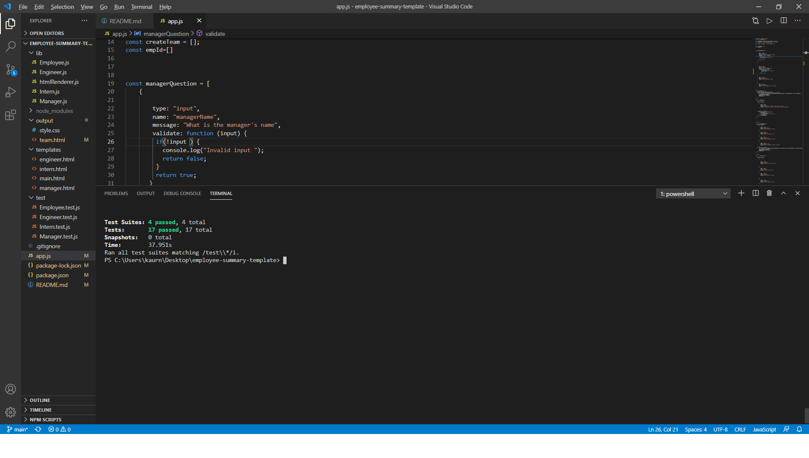
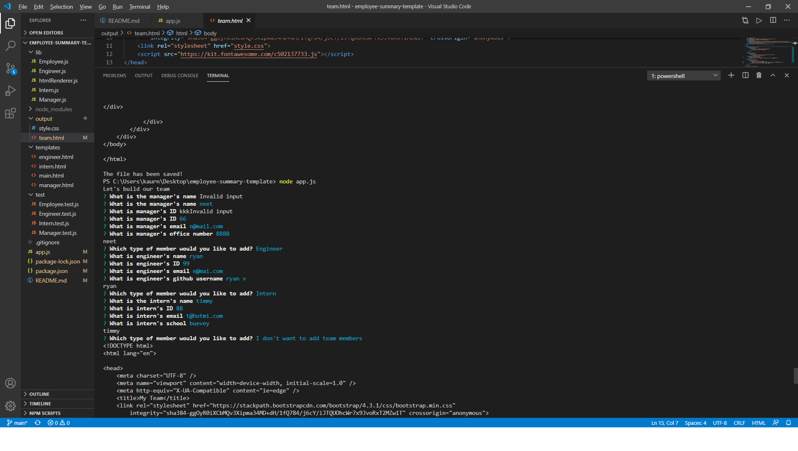
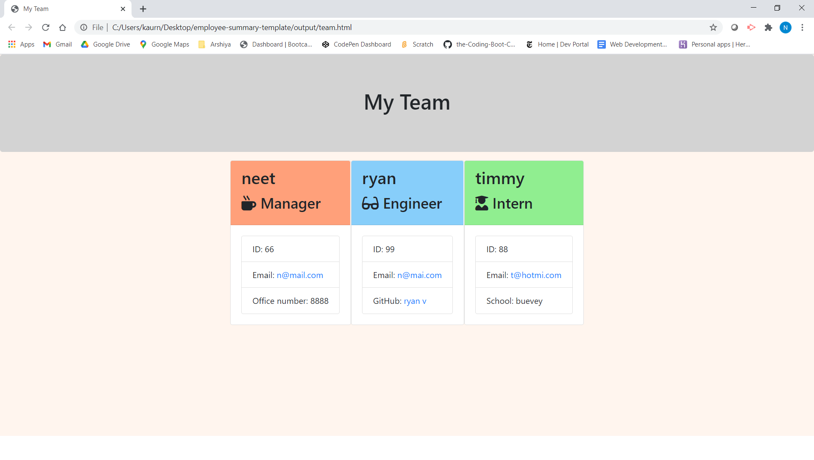

# About
In this assignment, created **Employee Summary Template** ,
with **npm inquirer** and created **CLASSES**
as well.

[OUTPUT](#Output)

[TEXT-EDITOR](#Text-Editor)

[LANGUAGE](#Language)

[RESOURCES-REFFERED](#Resources-Reffered)

[SCREENSHOT](#Screen-shot)

[TERMINAL-SCREENSHOT](#Terminal-Screenshot)

[GENERATED-TEAM-SCREENSSHOT](#Generated-Team-Screenshot)

[GITHUB-REPOSITORY](#GITHUB-REPOSITORY)

# Output

In this assignment , user is prompted with **QUESTIONS**,
about **MANAGER** ,**ENGINEER** and **INTERN** on 
**COMMANAD TERMINAL** with **npm inquirer**. Afterwords,
**html** file is generated. **In browser** **MY TEAM** 
is shown  and all teams are color co-ordinated as well.
**CLASSES** are also created as well.After prompt , question 
and answers    **DYNAMICALLY** **HTML**  file is created.

## Text-Editor

**VS-CODE**

##  Language

**HTML**

**NODE JS**

**Css**

**BOOTSTRAP**

## **Resources-Reffered**

[INQUIRER-DOCUMENTATION](https://www.npmjs.com/package/inquirer)

[FONT-AWESOME](https://fontawesome.com/icons?d=gallery)

## **Screen-shot**

 

 ## **Terminal-Screenshot**

 ## **Generated-Team-Screenshot**

 

 ## **GITHUB-REPOSITORY**
 [GITHUB-REPOSITORY-LINK](https://github.com/nehreetkaur/employee-summary-template)